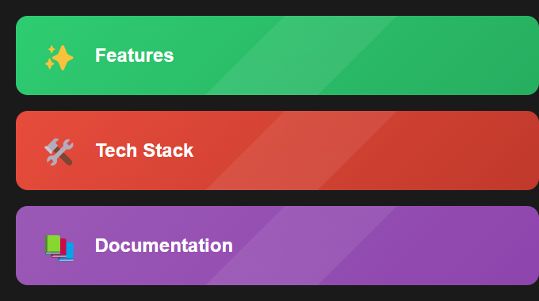

# 🤝 LegalMatch

<div align="center">


[](https://reactjs.org/)
[](https://www.typescriptlang.org/)
[](https://firebase.google.com/)
[](https://vitejs.dev/)
[](https://tailwindcss.com/)
[](https://nodejs.org/)
[](https://cloud.google.com/)

[English](#english) | [Русский](#русский)

</div>

---

<a name="english"></a>
# 🇺🇸 English

<div align="center">

</div>

## 📋 About
LegalMatch is a modern platform connecting clients with legal professionals, powered by AI assistance and real-time communication.

## ✨ Key Features
- 🤖 AI-powered lawyer matching
- 💬 Real-time consultations
- 📄 Secure document exchange
- 🔐 End-to-end encryption
- 🌐 Multi-language support

<div align="center">

</div>

## 🛠️ Tech Stack
- ⚛️ React + TypeScript
- 🔥 Firebase
- 🎨 Tailwind CSS
- 🚀 Vite
- 🤖 Google Gemini AI

## 📁 Project Structure
```
src/
├── components/     # UI Components
├── pages/         # Route Pages
├── services/      # API Services
├── hooks/         # Custom Hooks
├── utils/         # Helper Functions
└── types/         # TypeScript Types
```

## 🚀 Quick Start
```bash
# Install dependencies
npm install

# Start development server
npm run dev

# Build for production
npm run build
```

---

<a name="русский"></a>
# 🇷🇺 Русский

## 📋 О проекте
LegalMatch - современная платформа для поиска юристов с AI-ассистентом и общением в реальном времени.

<div align="center">

</div>

## ✨ Возможности
- 🤖 Умный подбор юристов
- 💬 Онлайн консультации
- 📄 Безопасный обмен документами
- 🔐 Сквозное шифрование
- 🌐 Мультиязычность

## 🛠️ Технологии
- ⚛️ React + TypeScript
- 🔥 Firebase
- 🎨 Tailwind CSS
- 🚀 Vite
- 🤖 Google Gemini AI

## 📁 Структура проекта
```
src/
├── components/     # UI компоненты
├── pages/         # Страницы
├── services/      # API сервисы
├── hooks/         # Хуки
├── utils/         # Утилиты
└── types/         # TypeScript типы
```

## 🚀 Быстрый старт
```bash
# Установка зависимостей
npm install

# Запуск сервера разработки
npm run dev

# Сборка для продакшена
npm run build
```

## 📦 Основные файлы

`.env` - Конфигурация окружения  
`.firebaserc` - Конфигурация Firebase  
`firebase.json` - Настройки Firebase  
`vite.config.ts` - Конфигурация Vite  
`tailwind.config.js` - Настройки Tailwind CSS  
`tsconfig.json` - Конфигурация TypeScript  

## 📫 Контакты
Email: abloko362@gmail.com